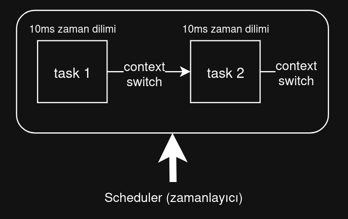
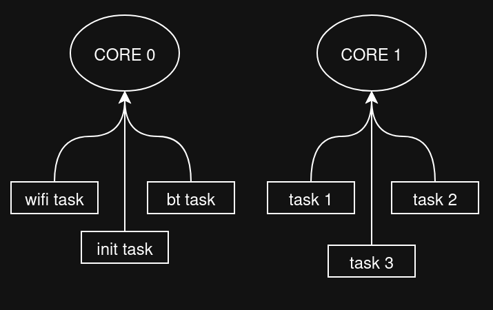
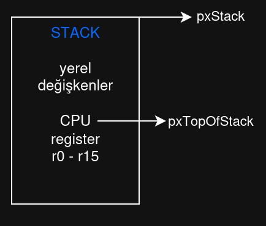
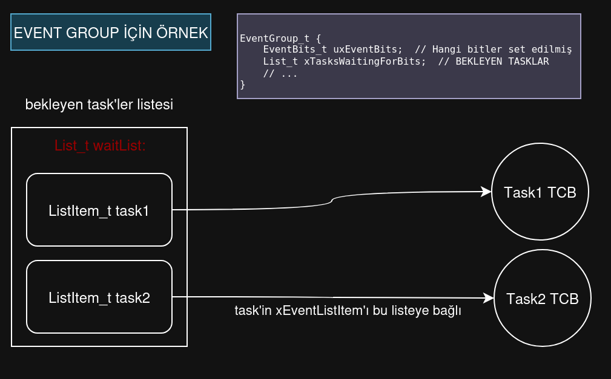
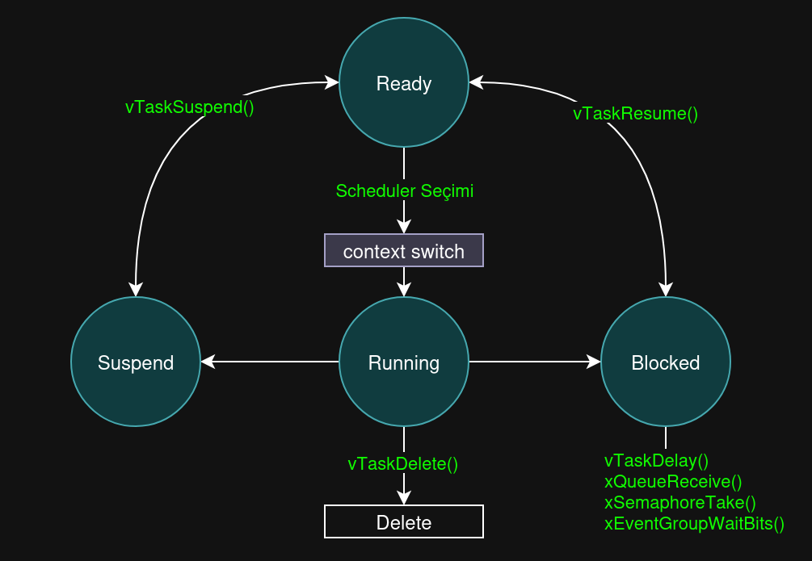
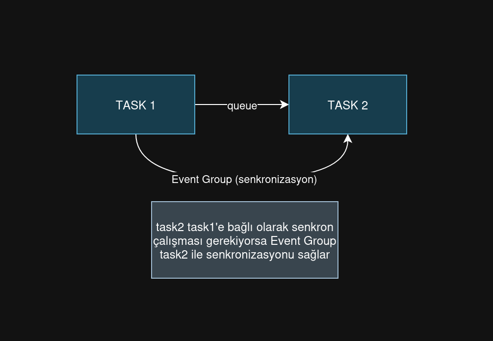
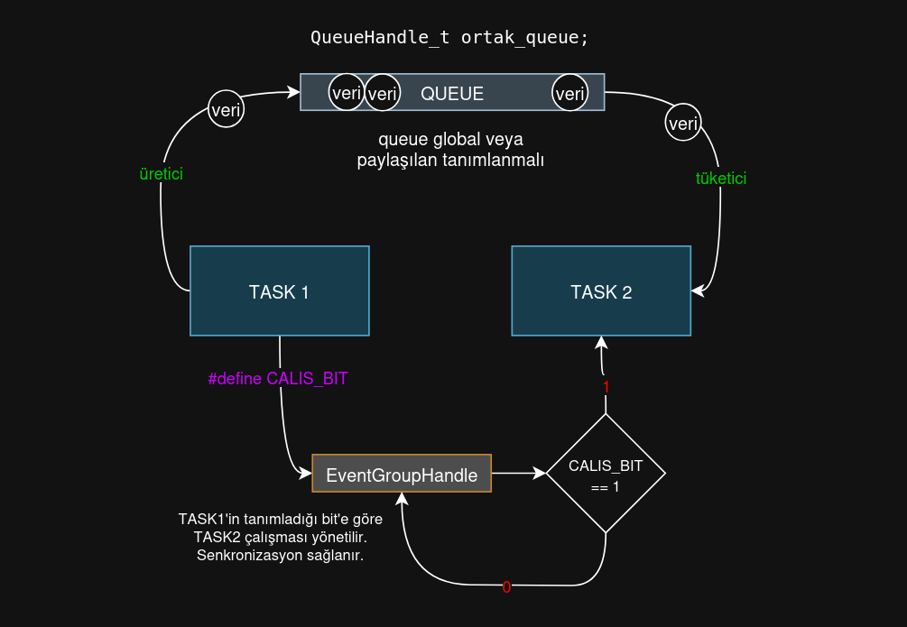

# ESP-IDF Task Nedir?

Evet bu yazımızda ESP-IDF Task nedir? nasıl kullanlır? ve mantığı nedir onu konuşacağız. En sonda da ayrı ayrı 2 adet task oluşturarak led yakacağız.

## TASK Mantığı

Task'ler Scheduler'in kararına göre ve priority'ye göre belirli bir zaman çalışan fonksiyonel kod bloklarıdır.



Task'ler tek çekirdekte Scheduler ile belirli zamanlarda çalışabilir. Ya da çift çekirdekli mikrodenetleyicilerde her bir çekirdeğe task'ler atanabilir.



Core0'da genellikler sistemin kullandığı taskler bulunur. Bunlar WiFi, Bluetooth olabilir. Core1'de ise sensörden veri okuma http işlemleri, mqtt işlemleri olabilir. (kullanıcı bazlı işlemler)

## Task Yapısı

Bir task oluştuğu zaman FreeRTOS şunları yapar:

```c
xTaskCreate(
    my_function,    // 1. Fonksiyon pointer (giriş noktası)
    "task_name",    // 2. İsim (debug için)
    2048,           // 3. Stack boyutu (byte)
    param,          // 4. Parametre (void*)
    5,              // 5. Öncelik (0-25, yüksek = önemli)
    &handle         // 6. Handle (kontrol için)
);
```
Bu task yapısındaki bilgilerin amaçları ise şudur:

- **fonksiyon pointer:** Task'in çalışma başlangıç adresidir. FreeRTOS ilk defa bu task'e geçtiği zaman PC (program counter) register'ı bu adrese ayarlanır. Return yaparsa task otomatik silinir. 
- **isim:** İnsanlar tarafından okunabilir bir etikettir. Kernel açısından bir özelliği yoktur.
- **stac boyutu:**: Her task kendi stack'ine sahiptir. Stackde yerel değişkeler, fonskiyon çağrıları, register değerleri, task parametreleri tutulur. Task içerisinde yapılan göreve göre stack boyutu ayarlanmalıdır. Eğer yetersiz kalırsa `stack overlow` yaşanabilir. 
- **parameter:** Parametere olarak gönderilern veri, task çalıştığı sürece geçerli olmalıdır. Stack'de tanımlı değeri gönderirseniz ve değer silinirse task patlar. 
- **öncelik (priority):** yüksek öncelikli taskler daha fazla core'da çalışır. 0-7 için, 0 en düşük öncelikli ve 7 en yüksek öncelikli task olarak tanımlanır. Aynı öncelikli task'lar `round-robin` algoritmasına göre çalışır. Yüksek öncelikli task hazır olduğunda düşük öncelikli task hemen kesilir.
- **handle:** Kontrol için kullanılır. Handle tanımlanıp verilirse task'ın durumunu öğrenebilir, taski durdurabilir veya tekrardan başlatabiliriz.

## Task Control Block - TCB

TCB her task için kernel'in RAM'de tuttuğu bir veri yapısıdır. Task'leri yönetmek için kullanılır.

```c
typedef struct tskTaskControlBlock {
    StackType_t *pxTopOfStack;      // Stack pointer 
    ListItem_t xStateListItem;      // Ready/Blocked listesi bağlantısı
    ListItem_t xEventListItem;      // Event listesi bağlantısı
    UBaseType_t uxPriority;         // Öncelik seviyesi
    StackType_t *pxStack;           // Stack başlangıcı
    char pcTaskName[configMAX_TASK_NAME_LEN];
    // ... diğer alanlar
} TCB_t;
```
#### pxStack
Task'im stack başlangıç adresidir.

#### pxTopOfStack

Task kesildiği zaman CPU register'larının kaydediliği son adresi tutar. Task tekrar çalıştığı zaman bu adresten başlayarak register verileri tekrardan yazılır.



Görselde bir adet stack vardır. Başlangıç adresi (pxStack) ve register verilerinin yazıldığı adres (pxTopOfStack) gösterilmiştir.

#### xStateListItem

Task'in hangi durumda olduğunu gösterir

```c
// FreeRTOS'un içindeki listeler
List_t pxReadyTasksLists[configMAX_PRIORITIES];  // Hazır task'lar
List_t xDelayedTaskList1;                          // Bekleyen (delay) task'lar
List_t xDelayedTaskList2;                          // Bekleyen task'lar (2.)
List_t xPendingReadyList;                          // Hazır olmayı bekleyen
List_t xTasksWaitingTermination;                   // Silinmeyi bekleyen
List_t xSuspendedTaskList;                         // Durdurulmuş task'lar

// Bir task READY durumundaysa:
stateListItem->pvContainer = &pxReadyTasksLists[priority];
```

#### xEventListItem

**event:** Bir task'in beklediği ve gerçekleştiğinde task'ın çalışmaya devam ettiği bir durumdur. `queue event`, `semaphore event` ve `event group` eventleri vardır. (burada anlatmak işleri uzatır)

Task bir event'i (queue'dan veri gelmesi) bekliyorsa, list event ile bekleme listesine alınır.

xEventListItem bağlantı notkası görevi görür. Task'In TCB'si beklenen kaynağın (queue, semaphore, eventgroup) bekleme listesine eklenir.

Event gerçekleştiğinde bekleme listesindeki TCB'ye ulaşır ve o taskı uyandırır.


```c
// Queue'dan okuma yaparken:
xQueueReceive(queue, &data, portMAX_DELAY);
// Task, eventListItem ile queue'nun bekleme listesine eklenir
```
EventGroup için basitleştirilmiş bir görsele bakalım:



Her bir task'in xEventlistItem'ı  bekleyen task listesine bağlıdır. Task  hangi kaynağı beklediğini xEventList ile bilir. xEventList ise TCB'ye bağlı olduğundan hangi Task'in ne kaynağı beklediğini bilir.

Bu konuyu daha detaylı daha sonraki yazılarımızda bakabiliriz, şu anda bunu bilsek yeterlidir.

#### uxPriority

Önceliğin tutulduğu değişkendir.

ESP32'deki öncelikler şu şekildedir:

```c
// ESP32'de öncelikler (0-25 arası, 25 en yüksek)
#define PRIORITY_IDLE         0  // Idle task (boşta CPU'yu düşük güce alır)
#define PRIORITY_LOW          1  // Loglama, non-critical
#define PRIORITY_BELOW_NORMAL 3  // Sensör okuma (periyodik)
#define PRIORITY_NORMAL       5  // Genel uygulama task'leri
#define PRIORITY_ABOVE_NORMAL 8  // UI güncelleme
#define PRIORITY_HIGH        10  // Veri işleme
#define PRIORITY_REALTIME    15  // Motor kontrol, gerçek zamanlı
#define PRIORITY_CRITICAL    20  // Watchdog, emergency stop
#define PRIORITY_SYSTEM      24  // FreeRTOS kernel (timer task)
```

#### pcTaskName

Task ismidir.


## Context Swtich

Bağlam değiştirme (Context Switch) ile task'leri cpu içerisinde değiştirebiliriz. Scheduler interrupt ile task'lerin çalışma zamanınının bittiğini ve TCB (Task Control Block) verilerine göre CPU'ya task'i alabilir.

Context Switch Task Durumlarında tam olarak `running` durumununda schedule'nin yaptığı bir görevdir.

#### Task Durum Diyagramı:



Blocked (bekle) durumu bir önceki anlattığım `xEventListItem` konusunun içeriğidir.


## Task'ler Arası İletişim (IPC)

Inter Process Communication (IPC) Task'lerin birbirinden izole olmasına rağmen veri paylaşmasını sağlar.



Queue iki task arasında veri taşımak için kullanılır (IPC). Bir task veri üretir (producer), diğer task veriyi tüketir (consumer).



Görselde ana yapı daha detaylı gösterilmiştir. Task1 ürettiği verileri `ortak_queue` adlı kuyruğa gönderir. Bu kuyruk iki task arasında veri gönderimini sağlar. Task2 ise bu üretilen verileri alır.

İki task arasındaki veri gönderim alım senkronizasyonu içinse  `EventGroupHandle` kullanılır. `TASK1`'in `CALIS_BIT` adlı tanımladığı bitin durumuna göre `TASK2` çalışmasına devam eder veya bekler. Bu sayede queue şişmesi durumu veya aşırı veri tüketimi gibi durumların önüne geçilir. Taskler birbirini beklemez, sadece `durumu kontrol eder`.


## Kodlamaya Geçiş

Evet task'leri genel bakış açısıyla öğrendik. Fark ettiyseniz bir konuyu az biraz detaylı anlatmak istersem bir sürü alt konu açılıyor. Bundan dolayı temel düzeyde tutmaya çalıştım. Daha sonraki yazılarımda alt konuları da detaylı konuşuruz.

Şimdi ise task'ler ile iki adet led yakalım.

İlk olarak her bir task için ve app_main için tag tanımlıyoruz ve sonrasında GPIO pinlerini ayarlıyoruz.
```c
#define APP_MAIN  "MAIN_TASK" // app_main için log tag
#define TASK1_TAG "LED1_TASK" // task 1 için log tag
#define TASK2_TAG "LED2_TASK" // task 2 için log tag

#define TASK1_LED1_GPIO 4     // task 1 için led pini
#define TASK2_LED2_GPIO 5     // task 2 için led pini
```

Daha sonra Task1 ve Task2 fonskiyonlarını yazıyoruz.

Task1 1 saniyede bir ledi yakıp söndürürken Task2 2 saniyede bir ledi yakıp söndürür.
```c
/* --- Task 1 ---*/ 
void led1_task (void *pvParameters)
{

    // GPIO ayarlama yapılır
    gpio_reset_pin(TASK1_LED1_GPIO);
    gpio_set_direction(TASK1_LED1_GPIO, GPIO_MODE_OUTPUT);

    while(1)
    {

        gpio_set_level(TASK1_LED1_GPIO, 1); // led 1'i aç
        ESP_LOGI(TASK1_TAG, "LED 1 Acildi",esp_log_timestamp()); // loglama

        vTaskDelay(1000 / portTICK_PERIOD_MS); // 1 saniye bekle

        gpio_set_level(TASK1_LED1_GPIO, 0); // led 1'i kapat
        ESP_LOGI(TASK1_TAG, "LED 1 Kapandi",esp_log_timestamp()); // loglama

        vTaskDelay(1000 / portTICK_PERIOD_MS); // 1 saniye bekle
    }
}
```

```c
/* --- Task 2 ---*/ 
void led2_task (void *pvParameters)
{
    // GPIO ayarlama yapılır
    gpio_reset_pin(TASK2_LED2_GPIO);
    gpio_set_direction(TASK2_LED2_GPIO, GPIO_MODE_OUTPUT);

    while(1)
    {

        gpio_set_level(TASK2_LED2_GPIO, 1); // led 2'yi aç
        ESP_LOGI(TASK2_TAG, "LED 2 Acildi",esp_log_timestamp()); // loglama

        vTaskDelay(2000 / portTICK_PERIOD_MS); // 2 saniye bekle

        gpio_set_level(TASK2_LED2_GPIO, 0); // led 2'yi kapat
        ESP_LOGI(TASK2_TAG, "LED 2 Kapandi",esp_log_timestamp()); // loglama

        vTaskDelay(2000 / portTICK_PERIOD_MS); // 2 saniye bekle
    }
}
```

En sonunda ise `app_main` içerisinde oluşturmuş olduğumuz task fonskiyonları ile beraber task'leri tanımlıyoruz.

```c
void app_main(void)
{
    ESP_LOGI (APP_MAIN,"App main icerisinde task'ler olusturuluyor !",esp_log_timestamp());


    // task1 oluşturma
    xTaskCreate(
        led1_task,          // task fonksiyonu
        "LED1_TASK",        // task adı
        2048,               // stack boyutu
        NULL,               // parametre
        1,                  // öncelik
        NULL                // task handle
    );

    // task2 oluşturma
    xTaskCreate(
        led2_task,
        "LED2_TASK",
        2048,
        NULL,
        1,
        NULL
    );

    // app main'in işi burada biter
    // tasklar çalışmaya devam eder.
    ESP_LOGI(APP_MAIN,"App main gorevini tamamladı, task'ler calismaya devam ediyor !",esp_log_timestamp());
}
```

ESP32 kartımıza kodu atıp monitor yaparsak loglarda şu şekilde bir çıktı alırız:

```bash
I (283) main_task: Started on CPU0
I (293) main_task: Calling app_main()
I (293) MAIN_TASK: App main icerisinde task'ler olusturuluyor !
I (293) LED1_TASK: LED 1 Acildi
I (293) MAIN_TASK: App main gorevini tamamladı, task'ler calismaya devam ediyor !
I (303) LED2_TASK: LED 2 Acildi
I (303) main_task: Returned from app_main()
I (1293) LED1_TASK: LED 1 Kapandi
I (2293) LED1_TASK: LED 1 Acildi
I (2303) LED2_TASK: LED 2 Kapandi
I (3293) LED1_TASK: LED 1 Kapandi
I (4293) LED1_TASK: LED 1 Acildi
I (4303) LED2_TASK: LED 2 Acildi
I (5293) LED1_TASK: LED 1 Kapandi
I (6293) LED1_TASK: LED 1 Acildi
I (6303) LED2_TASK: LED 2 Kapandi
I (7293) LED1_TASK: LED 1 Kapandi
I (8293) LED1_TASK: LED 1 Acildi
I (8303) LED2_TASK: LED 2 Acildi
I (9293) LED1_TASK: LED 1 Kapandi
I (10293) LED1_TASK: LED 1 Acildi
I (10303) LED2_TASK: LED 2 Kapandi
```

Fark ettiyseniz `MAIN_TASK` task'leri oluşturup görevini sonlandırdı. Bu da tam olarak istediğimiz bir yapıyı oluşturduğunu gösteriyor.


# Sonuç
Evet bu yazımızda Task nedir genel yapısı ile öğrendik ve task'leri kullanarak iki farklı ledi yaktık.

Sonraki yazılarda görüşene dek hoşçakalın !