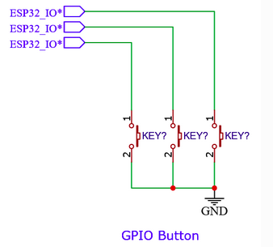
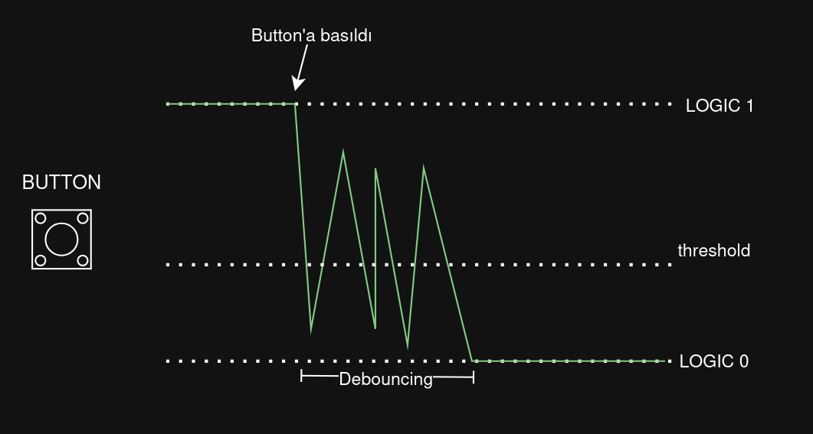

# ESP-IDF BUTTON

ESP32 GPIO ile buton nasıl kullanılır bu yazımda bunu anlatacağım. Evet kolay bir konu ama bazen sorun yaşayabiliyorum ve bunun için bu yazı burda olsun istiyorum.

> Daha detaylı ve sıkıcı dökümante için [espressif dökümanlarına](https://docs.espressif.com/projects/esp-iot-solution/en/latest/input_device/button.html) bakabilirsiniz.



ESP gpio pinlerine button bağlayarak veri bilgisini alabilir. Burada kullanılan birkaç yöntem vardır.
- en kolay ama verimsiz olan polling
- mantıklı olan interrupt

Son olarak buton'ları bağlarken normalde pullup veya pulldown direnç koyulmalıdır ama biz ESP içerisindeki dirençleri aktif edeceğiz.

## Polling ile Button Kullanımı

En kolayı budur ama gereksiz kontrol ile CPU'yu boşa harcar.

```c
#define LED_GPIO 4
#define BUTTON_GPIO 5

// debounce için son buton durumunu saklayacak bir değişken
static int last_button_state = 1; // buton başlangıçta HIGH (pull-up nedeniyle)

void app_main(void)
{

    // ilk olarak GPIO pinlerini resetleyelim
    gpio_reset_pin(LED_GPIO);
    gpio_reset_pin(BUTTON_GPIO);

    // şimdi pinlerin yönlerini ayarlayalım
    gpio_set_direction(LED_GPIO, GPIO_MODE_OUTPUT);
    gpio_set_direction(BUTTON_GPIO, GPIO_MODE_INPUT);

    // buton'un pull-up direncini aktif edelim
    gpio_set_pull_mode(BUTTON_GPIO, GPIO_PULLUP_ONLY);

    // başlangıçta LED kapalı olsun
    gpio_set_level(LED_GPIO, 0);


    while (true)
    {   
        // buton'un durumunu okuyalım
        int button_state = gpio_get_level(BUTTON_GPIO);

        if(button_state != last_button_state) {
            // buton durumunda değişiklik var, debounce için biraz bekleyelim
            vTaskDelay(50/portTICK_PERIOD_MS); // 50ms debounce süresi
            
            gpio_set_level(LED_GPIO, button_state== 0 ? 1 : 0); // buton basılıysa LOW olur, bu yüzden LED'i açmak için 1 yapıyoruz

            last_button_state = button_state; // son buton durumunu güncelle
        }
        // cpu'yu meşgul etmemek için delay ekleyelim
        vTaskDelay(100/portTICK_PERIOD_MS); 
    }
}
```

Kodda görüldüğü gibi butonun durumunu alıp en sonki durumdan farklıysa led'i o durum yapıyoruz. yani edge durumlarını bu kodla tespit ediyoruz.

Button debounce durumunu es geçmek için 50ms bekliyoruz ve sonra LED yakma işlemine geçiyoruz. Button debouncing'i azaltmanın yazılımsal olarak çözümlerinden birisi delay eklemektir. Bu bizi parazit verilerden korur.



> Diğer bir çözüm ise mikrodenetleyiciye giden sinyal ile gnd arasında uF düzeyinde kondansatör koymaktır.


Kodu çalıştırdığınızda göreceksiniz ki butona bastığım zaman led yanacaktır. En basit buton kullanımı bu şekildedir.

## Interrupt ile Button Kullanımı

Kesme (Interrupt) mekanizması bilgisayar ve mikrodeneyleyicilerin en önemli mekanizmalarından birisidir. Kesme sayesinde performanslı bir şekilde kod yazılabilir. Ayrıca bazı sistemler kesme olmadan çalışamaz durumdadır.

Kesme akışı şu şekildedir:
- app_main() içerisinde while(1) ile normal akış sürer
- Kesme geldiğinde:
    - Buton basılır
    - CPU hemen normal akışı durdurur
    - Kesme Handler (ISR) çalışır
    - ISR biter, CPU gerektiği yerden devam eder

Şimdi interupt ile buton kodu yazalım:

```c
#define LED_GPIO 4
#define BUTTON_GPIO 5

// kesme ile buton kullanımı //

//kesmede buton bilgisi tutmak için queue tanımlanır
static QueueHandle_t button_queue = NULL;

// kesme handler fonksiyonu
static void IRAM_ATTR button_isr_handler(void* arg) {
    int pin = (int ) arg;

    bool button_state = gpio_get_level(pin);
    
    // ISR içerisinde Queue'ye buton durumunu gönder
    // bunun için özel kod vardır.
    xQueueSendFromISR(button_queue, &button_state, NULL);
}

// Buton durumunu işlemek için TASK fonksiyonu tanımlanır
static void button_task (void* arg) {
    int button_state;
    bool led_on = false;
    while (1) {
        // Queue'den buton durumunu al, sonuz bekle (portMAX_DELAY)
        if (xQueueReceive(button_queue, &button_state, portMAX_DELAY)) {
            // kesme gelirse bu if içerisine girilir.

            // debounce için delay
            vTaskDelay(50 / portTICK_PERIOD_MS); // 50ms debounce süresi
            
            // Buton durumuna göre LED'i kontrol et
            // baslıdığında 0 olur
            if (button_state == 0) {
                led_on = !led_on; // LED durumunu değiştir
                gpio_set_level(LED_GPIO, led_on); // LED'i aç veya kapat
            }
        }
    }
}


void app_main(void)
{

    // GPIO pinlerini tanımla
    gpio_reset_pin(LED_GPIO);
    gpio_set_direction(LED_GPIO, GPIO_MODE_OUTPUT);
    gpio_set_level(LED_GPIO, 0);  // LED söndür

    gpio_reset_pin(BUTTON_GPIO);
    gpio_set_direction(BUTTON_GPIO, GPIO_MODE_INPUT);
    gpio_set_pull_mode(BUTTON_GPIO, GPIO_PULLUP_ONLY); // pull-up direnci kullan

    // buton kesmesini ayarla
    // negatif kenar kesmesi (butona basıldığında tetiklenir)
    gpio_set_intr_type(BUTTON_GPIO, GPIO_INTR_NEGEDGE); 

    // kuyruğu oluştur
    button_queue = xQueueCreate(10, sizeof(int)); // 10 elemanlı, int tipinde bir kuyruk

    // kesmeyi başlat
    gpio_install_isr_service(0); // ISR hizmetini başlat
    // buton kesmesini handler'a bağla
    // BUTTON_GPIO parametre olarak gönder.
    gpio_isr_handler_add(BUTTON_GPIO, button_isr_handler, (void*)BUTTON_GPIO); 
    
    // buton takip TASK'ını oluştur
    // öncelik 10
    xTaskCreate(button_task, "button_task", 2048, NULL, 10, NULL);

    while (true) {
        // Ana döngüde başka işlemler yapılabilir
        vTaskDelay(1000 / portTICK_PERIOD_MS); // 1 saniye bekle
    }
}
```

Kod daha karmaşık gözüküyor olabilir ama buton durumunu direkt okuduğumuz için kullanım doğruluğu çok iyi durumda. Tek tek açıklayalım

```c
//kesmede buton bilgisi tutmak için queue tanımlanır
static QueueHandle_t button_queue = NULL;

// kesme handler fonksiyonu
static void IRAM_ATTR button_isr_handler(void* arg) {
    int pin = (int ) arg;

    bool button_state = gpio_get_level(pin);
    
    // ISR içerisinde Queue'ye buton durumunu gönder
    // bunun için özel kod vardır.
    xQueueSendFromISR(button_queue, &button_state, NULL);
}
```

Bir adet queue oluşturarak kesme geldiği zaman buton işlerini yapan task'e kuyruktan veri göndeririz.

`IRAM_ATTR` ise kesme oluştuğu zaman yönlendirilen fonksiyonu ifade eder. Bu fonksiyon içerisinde ağır işlemler yapılmamalıdır. Göründüğü üzere buton bilgisini alıp queue'a gönderiyoruz.

```c
// Buton durumunu işlemek için TASK fonksiyonu tanımlanır
static void button_task (void* arg) {
    int button_state;
    bool led_on = false;
    while (1) {
        // Queue'den buton durumunu al, sonuz bekle (portMAX_DELAY)
        if (xQueueReceive(button_queue, &button_state, portMAX_DELAY)) {
            // kesme gelirse bu if içerisine girilir.

            // debounce için delay
            vTaskDelay(50 / portTICK_PERIOD_MS); // 50ms debounce süresi
            
            // Buton durumuna göre LED'i kontrol et
            // baslıdığında 0 olur
            if (button_state == 0) {
                led_on = !led_on; // LED durumunu değiştir
                gpio_set_level(LED_GPIO, led_on); // LED'i aç veya kapat
            }
        }
    }
}
```

Buton interrup'tından sonra gönderilen veriyi kuyruktan alan task ise `button_task`dir.

Bu task içerisinde `xQueueReceive` ile veri gelesiye kadar bekleme listesinde kalır. Veri geldiğinde buton durumuna göre ledi yakar veya söndürür.

app_main içerisinde ise ayarlamalar yapılır. Önemli olan kısımlara bakalım:

```c
gpio_set_intr_type(BUTTON_GPIO, GPIO_INTR_NEGEDGE); 
```
Buton pinine interrupt atılır. `GPIO_INTR_NEGEDGE` ile düşen kenarda kesmeyi tetikleriz. 


```c
gpio_install_isr_service(0); // ISR hizmetini başlat
    // button kesmesini handler'a bağla
    // BUTTON_GPIO parametre olarak gönder.
    gpio_isr_handler_add(BUTTON_GPIO, button_isr_handler, (void*)BUTTON_GPIO); 
```

Burada ise ISR (Interrupt Service Routine) aktif edilir. GPIO pinine handler fonksiyonu bağlanır ve parametre olarak BUTTON_GPIO verilir.
```c
    xTaskCreate(button_task, "button_task", 2048, NULL, 10, NULL);

    while (true) {
        // Ana döngüde başka işlemler yapılabilir
        vTaskDelay(1000 / portTICK_PERIOD_MS); // 1 saniye bekle
    }
```
En sonda ise task oluşturulur ve `app_main` while döngüsü içerisine alınır.


# Sonuç

ESP içerisinde buton kullanımını öğrendik.

Sonraki yazılarda görüşene dek hoşçakalın !